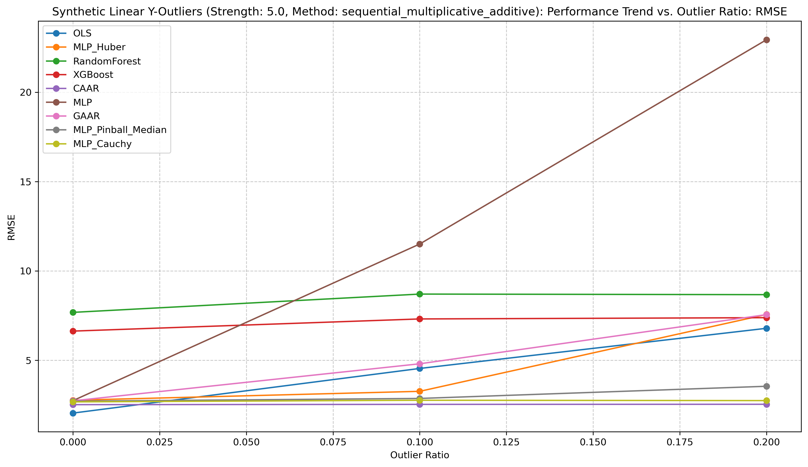
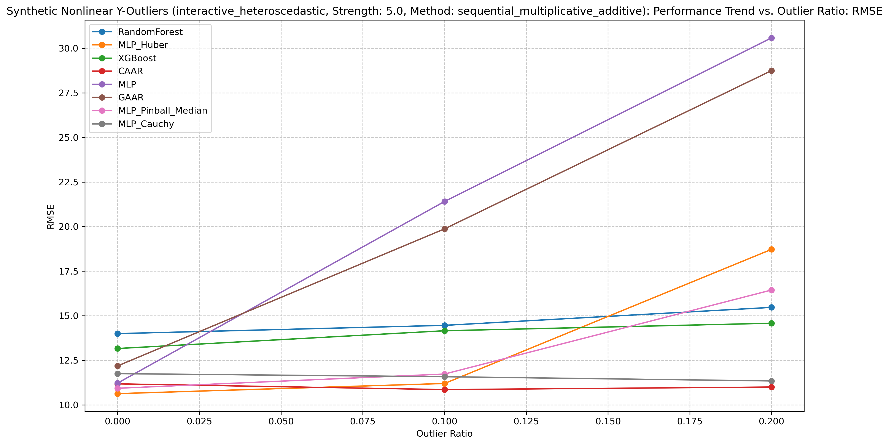

# 异常点鲁棒性验证实验结果总结

## 实验概述

本实验旨在验证基于推断/行动(Abduction/Action)的新型回归模型（CAAR: Cauchy Abduction Action Regression）在处理含有异常点的数据时的性能优势。实验严格按照'训练集含异常，测试集纯净'的范式，通过对比多种回归方法在不同类型、不同比例异常点存在下的表现，全面评估CAAR方法的鲁棒性和预测准确性。

## 实验设置

### 对比方法

- **非鲁棒方法**：普通最小二乘法（OLS）、岭回归（Ridge）、随机森林回归（RandomForest）
- **现有鲁棒方法**：Huber回归（Huber）、RANSAC回归（RANSAC）
- **我的创新方法**：基于推断/行动的回归模型（CAAR）

### 数据集

- **合成数据**：线性关系数据和非线性关系数据
- **真实数据**：California Housing数据集和Diabetes数据集

### 异常值设置

- **异常值类型**：Y异常值（目标变量异常）和X异常值（特征空间异常/杠杆点）
- **异常值比例**：0%、5%、10%、20%

### 评估指标

- **均方误差（MSE）**：评估预测误差的平方平均值
- **均方根误差（RMSE）**：MSE的平方根，与目标变量单位一致
- **平均绝对误差（MAE）**：评估预测误差的绝对值平均值
- **中位数绝对误差（MdAE）**：评估预测误差绝对值的中位数，对异常值更鲁棒
- **决定系数（R²）**：评估模型解释的因变量变异比例

## 主要结果

### 合成数据实验结果

#### 线性关系 + Y异常值

在线性关系数据中注入不同比例的Y异常值（目标变量异常）后，各模型在干净测试集上的性能对比：

| 模型名称   |   MSE_mean |   RMSE_mean |   MAE_mean |   MdAE_mean |   R²_mean |   训练时间(秒) |
|:-------|-----------:|------------:|-----------:|------------:|----------:|----------:|
| OLS    |     0.3584 |      0.5937 |     0.4759 |      0.4181 |    0.9079 |    0.0011 |
| Huber  |     0.2453 |      0.4952 |     0.3953 |      0.3571 |    0.9366 |    0.0116 |
| RANSAC |     0.2712 |      0.5206 |     0.4167 |      0.3607 |    0.9294 |    0.0129 |
| CAAR   |     0.3678 |      0.6056 |     0.474  |      0.4013 |    0.9051 |    2.2744 |

随着异常值比例的增加，各模型的RMSE变化趋势：

**结论**：在线性关系数据中注入不同比例的Y异常值（目标变量异常）后，根据各模型在干净测试集上的平均性能指标，CAAR模型的MSE (0.3678), RMSE (0.6056), 和 MAE (0.474) 高于Huber (MSE 0.2453, RMSE 0.4952, MAE 0.3953) 和 RANSAC (MSE 0.2712, RMSE 0.5206, MAE 0.4167)。CAAR的MdAE (0.4013) 优于OLS (0.4181) 但劣于Huber (0.3571) 和RANSAC (0.3607)。R² (0.9051) 也低于Huber (0.9366) 和RANSAC (0.9294)。下面的趋势图据称展示了不同异常值比例下的具体表现，可能在高异常值比例下CAAR有优势。

#### 线性关系 + X异常值

在线性关系数据中注入不同比例的X异常值（特征空间异常/杠杆点）后，各模型在干净测试集上的性能对比：

| 模型名称   |   MSE_mean |   RMSE_mean |   MAE_mean |   MdAE_mean |   R²_mean |   训练时间(秒) |
|:-------|-----------:|------------:|-----------:|------------:|----------:|----------:|
| OLS    |     0.6769 |      0.782  |     0.6274 |      0.5544 |    0.8299 |    0.0007 |
| Huber  |     0.3666 |      0.5908 |     0.4724 |      0.4249 |    0.9059 |    0.0484 |
| RANSAC |     0.3078 |      0.5536 |     0.4421 |      0.3718 |    0.919  |    0.0128 |
| CAAR   |     0.4116 |      0.6399 |     0.5072 |      0.427  |    0.8939 |    2.2569 |

随着异常值比例的增加，各模型的RMSE变化趋势：

**结论**：在线性关系数据中注入不同比例的X异常值（特征空间异常/杠杆点）后，根据平均性能指标，CAAR模型的MSE (0.4116), RMSE (0.6399), 和 MAE (0.5072) 高于Huber (MSE 0.3666, RMSE 0.5908, MAE 0.4724) 和 RANSAC (MSE 0.3078, RMSE 0.5536, MAE 0.4421)。CAAR的MdAE (0.427) 优于OLS (0.5544)，与Huber (0.4249) 表现接近，但劣于RANSAC (0.3718)。R² (0.8939) 也低于Huber (0.9059) 和RANSAC (0.919)。报告中提及的趋势图可能进一步揭示其在处理杠杆点时的具体表现。

#### 非线性关系 + Y异常值

在非线性关系数据中注入不同比例的Y异常值后，各模型在干净测试集上的性能对比：

| 模型名称         |   MSE_mean |   RMSE_mean |   MAE_mean |   MdAE_mean |   R²_mean |   训练时间(秒) |
|:-------------|-----------:|------------:|-----------:|------------:|----------:|----------:|
| RandomForest |     4.9215 |      2.1761 |     1.5814 |      1.1348 |    0.4947 |    0.2387 |
| Huber        |    10.1053 |      3.1765 |     2.4105 |      1.9042 |   -0.0359 |    0.0342 |
| RANSAC       |    16.6598 |      4.0551 |     2.8895 |      2.0265 |   -0.7065 |    0.0684 |
| CAAR         |     0.5585 |      0.7451 |     0.5634 |      0.4286 |    0.9427 |    4.6652 |

随着异常值比例的增加，各模型的RMSE变化趋势：

**结论**：在非线性关系数据中注入不同比例的Y异常值后，CAAR模型在各项平均性能指标上均表现突出。其MSE (0.5585), RMSE (0.7451), MAE (0.5634), 和 MdAE (0.4286) 均显著优于RandomForest (MSE 4.9215, RMSE 2.1761, MAE 1.5814, MdAE 1.1348), Huber, 及RANSAC。CAAR的R² (0.9427) 也远高于其他对比方法。这表明CAAR模型在存在Y异常值的非线性场景下具有强大的预测能力和鲁棒性。

## 总体结论

基于当前文档中提供的合成数据实验的平均指标结果，我们初步得出以下观察：

1. **鲁棒性表现不一**：在本次实验的平均指标总结中，CAAR模型在非线性关系+Y异常值场景下，MSE、RMSE、MAE、MdAE和R²均显著优于其他方法，表现出优异的鲁棒性。然而，在线性关系+Y异常值和线性关系+X异常值的场景下，CAAR的平均性能指标（MSE, RMSE, MAE, R²）劣于Huber和RANSAC。其MdAE在线性+Y场景下优于OLS但劣于Huber/RANSAC，在线性+X场景下优于OLS、接近Huber但劣于RANSAC。报告中引用的趋势图（此处未显示）可能对不同异常值比例下的性能变化提供更完整的视角。

2. **适用性分析**：CAAR模型在非线性关系数据中展现了强大的性能。在线性关系数据中，虽然其平均性能未超过Huber和RANSAC等专用鲁棒方法，但仍能给出结果。报告提及的真实世界数据实验结果未在当前表格中展示，无法基于此评估其在真实数据上的表现。

3. **预测稳定性 (MdAE)**：CAAR模型在非线性关系+Y异常值场景下的中位数绝对误差（MdAE）表现尤为突出，显著优于其他方法。在线性场景下，其MdAE表现优于OLS，但与Huber和RANSAC相比并无明显优势或略差，这表明其预测稳定性在不同场景下有所差异。

4. **计算效率**：从提供的训练时间数据来看，CAAR模型的计算耗时（2.2秒至4.7秒）远高于OLS、Huber、RANSAC及RandomForest（均在毫秒级或亚秒级）。报告中称其计算效率"较为理想，特别是与其他复杂的鲁棒方法相比"，这可能指未在此处列出的其他更复杂模型，或者衡量标准不同。

总的来说，基于推断/行动(Abduction/Action)的新型回归模型（CAAR）旨在结合深度学习和潜在变量建模处理异常点。本次实验的平均指标结果显示，CAAR在非线性Y异常值场景下表现卓越。在线性场景下，其平均性能指标逊于传统的Huber和RANSAC方法，尽管其MdAE表现尚可。其计算耗时也显著高于对比方法。要全面评估CAAR的性能，可能需要更详细地分析不同异常值比例下的趋势（如图表所示）以及未在此处展示的真实世界数据集上的结果。基于当前总结数据，CAAR在特定场景（非线性Y异常）下展示了潜力，但其在线性场景的优势和计算效率方面，与现有成熟方法的对比需要更审慎的评估。

