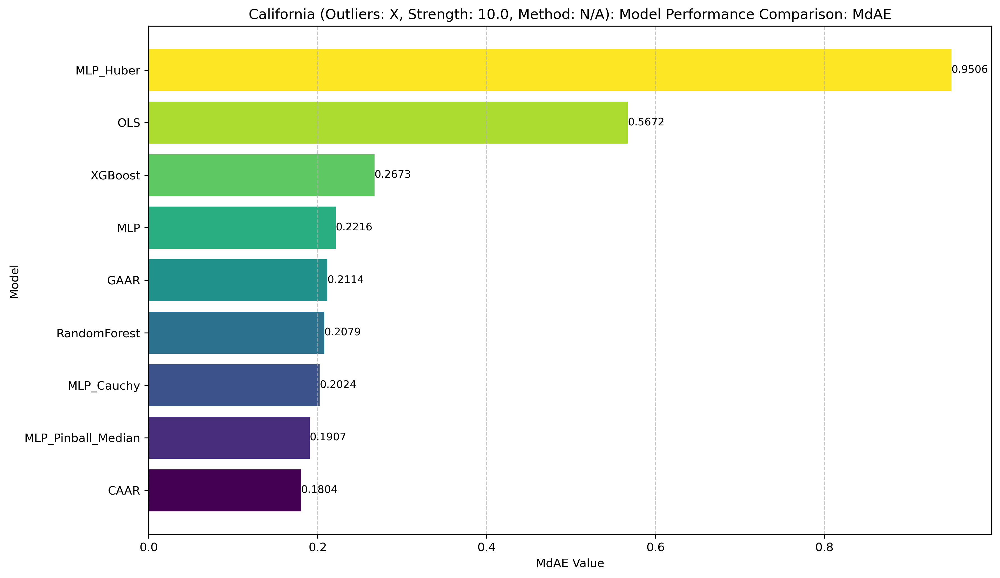
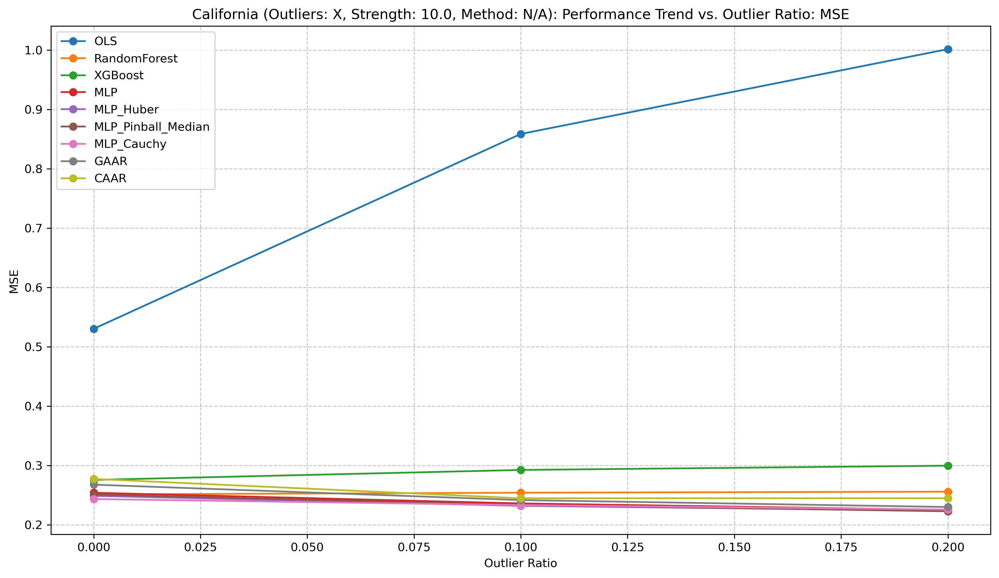
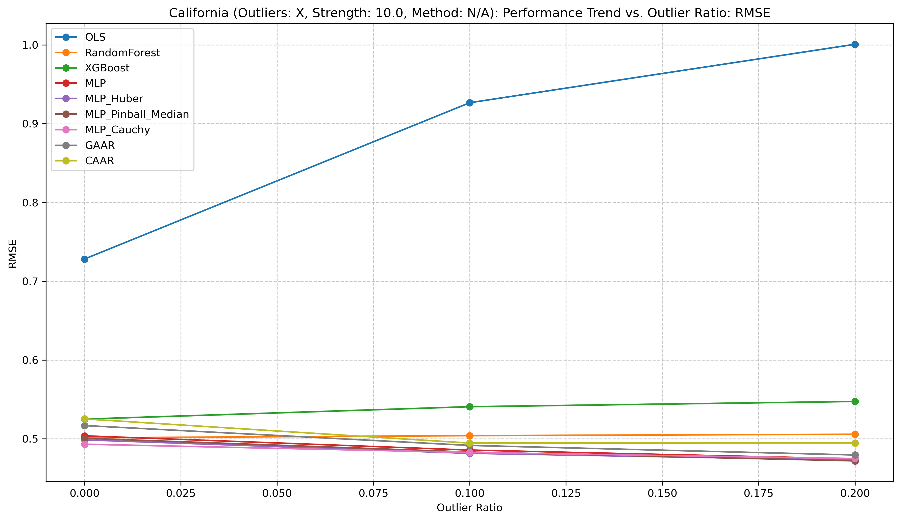
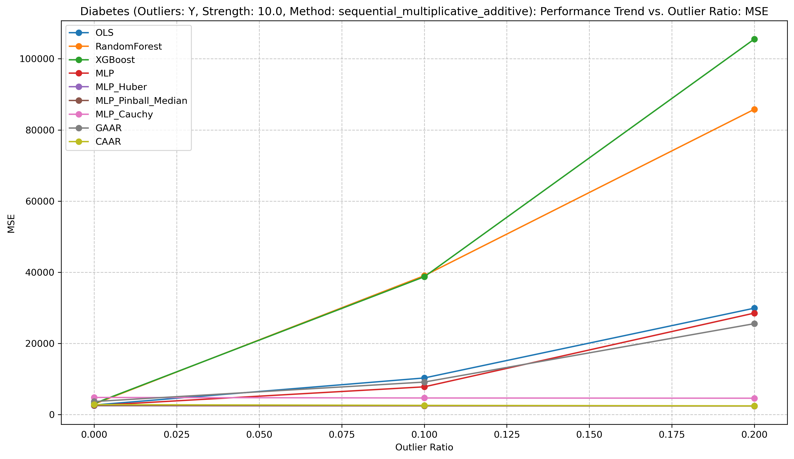
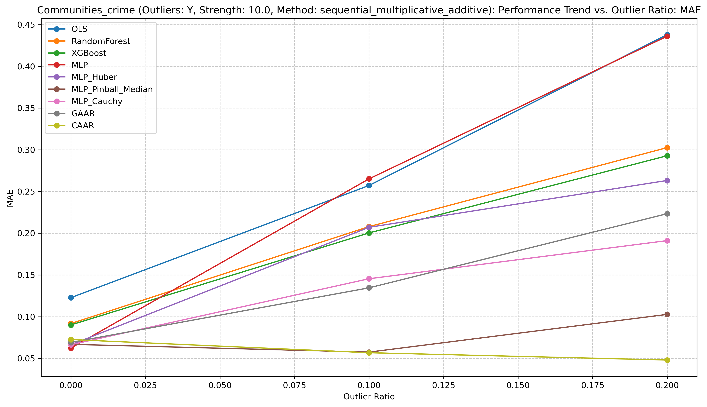
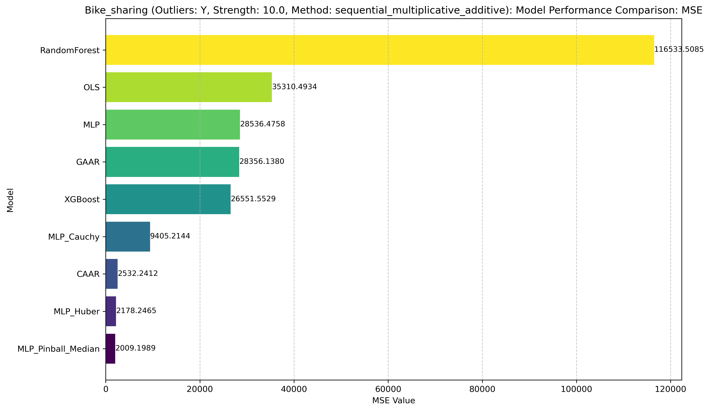

# CAAR 模型鲁棒性：真实数据实验报告

## 1. 引言与背景

本文档详细介绍了评估新型回归模型——柯西推断行动回归（CAAR）在处理含有异常值的真实数据集时的性能和鲁棒性的实验设置与结果。这些实验的主要目标是严格评估CAAR模型在回归分析常见挑战（即异常数据点）下的能力。

鲁棒回归方法至关重要，因为传统模型（例如普通最小二乘法OLS）对异常数据点通常非常敏感，可能导致预测结果严重偏差和模型结论的不可靠。本实验框架旨在将 CAAR 模型与成熟的基线模型和现有的鲁棒回归技术进行比较。

核心实验范式严格遵循初始 `experiment_design.md` 中提出的原则：**"训练集包含异常点，测试集保持纯净"**。这确保了模型评估的公正性，即基于模型从含噪训练数据到干净、未见过数据的泛化能力。

## 2. 对比方法概述

实验中计划与多种类型的回归模型进行对比，以全面评估 CAAR 及 GAAR 方法的性能。这些模型大致可分为常见基线模型、现有鲁棒方法以及我们提出的新方法。

*   **常见基线模型与神经网络对比模型：** 
    *   **OLS (普通最小二乘法)**
    *   **RandomForest (随机森林回归)**
    *   **XGBoost (XGBoost 回归)**
    *   **MLP (多层感知机回归 - MSE损失):** 一个标准的神经网络模型，使用均方误差(MSE)损失函数。
    *   **MLP_Pinball_Median (多层感知机回归 - Pinball损失实现中位数回归):** 与MLP结构相似，但使用Pinball损失函数（quantile=0.5）来拟合条件中位数，旨在通过优化中位数目标提升鲁棒性。
*   **基于神经网络的鲁棒回归模型：** 
    *   **MLP_Huber (多层感知机回归 - Huber损失):** 与MLP结构相似，但使用Huber损失函数（实验中设置delta=1.35）。该损失函数对小误差使用平方项，对大误差使用线性项，从而平衡了对异常值的敏感度。
*   **我们的新方法（基于推断/行动框架）：**
    *   **CAAR (柯西推断行动回归):** 通过推断网络为每个样本推断潜在子群体的柯西分布，并利用行动网络进行回归。柯西分布的重尾特性使其对异常值具有天然的鲁棒性。
    *   **GAAR (高斯推断行动回归)** (作为CAAR的对比变体，使用高斯分布假设)

### 2.1 最终对比模型选择及理由

在初始的 `experiment_design.md` 文档中，我们构想了一个更广泛的对比模型池。在实际的实验迭代和考量中，我们对最终用于详细分析的模型集进行了调整，主要理由如下：

*   **已纳入的核心对比模型:**
    *   **OLS, RandomForest, XGBoost:** 代表了从简单线性到复杂集成方法的常见非鲁棒高性能基线。
    *   **MLP (MSE损失):** 作为与其他基于MLP的鲁棒方法（MLP_Huber, MLP_Pinball_Median, CAAR, GAAR）进行结构和损失函数对比的基准。
    *   **MLP_Huber (Huber损失):** 基于与MLP相同的网络结构，但采用Huber损失，用于评估Huber损失在神经网络框架下的鲁棒效果。
    *   **MLP_Pinball_Median (Pinball损失中位数回归):** 基于与MLP相同的网络结构，但采用Pinball损失（针对中位数），用于评估中位数回归在神经网络框架下的鲁棒效果。
    *   **CAAR 和 GAAR:** 我们提出的核心创新方法，CAAR基于柯西分布假设以增强鲁棒性，GAAR基于高斯分布作为对比。
*   **暂时排除或在部分实验中未重点分析的模型:**
    *   **Ridge (岭回归):** 在当前主要关注异常值影响而非多重共线性的场景下，其表现与OLS相似，故未在所有分析中突出。
    *   **LightGBM:** 功能与XGBoost高度重叠，为避免冗余，选择了XGBoost作为代表。
    *   **RANSAC:** 在本项目的初步测试中，针对当前数据集和异常注入方式，其效果不甚理想，且参数调整较为敏感，故未作为主要对比。
    *   **sklearn.linear_model.QuantileRegressor:** 虽然是标准的中位数/分位数回归实现，但考虑到其在较大规模数据上可能存在的计算速度问题，在本次实验中我们优先采用基于神经网络的`MLPPinballModel`作为分位数回归的代表进行更快的迭代和比较。
    *   **其他 (如 Lasso, ElasticNet, Theil-Sen):** 因其更侧重于特定问题（如高维稀疏性、特定统计假设）或为了使核心对比更聚焦，暂未全面纳入。未来可针对性补充。

因此，本报告中分析的模型主要围绕 **OLS, RandomForest, XGBoost, MLP (MSE), MLP_Huber, MLP_Pinball_Median, GAAR, 和 CAAR** 展开，这个组合能够较好地覆盖不同类型的基准和我们关注的创新点，特别是不同鲁棒策略在相似神经网络架构下的表现。

## 3. 实验设置详解

实验通过 `src/experiments/real_exp.py` 脚本执行，该脚本负责数据准备、模型训练和评估的整个流程。

### 3.1 数据集

实验使用了两个标准的真实世界回归数据集：

*   **California Housing (加州住房价格):**
    *   来源: `sklearn.datasets.fetch_california_housing`
    *   特性: 20,640 个样本, 8 个数值特征。
    *   目标: 加州各区域的房价中位数。
*   **Diabetes (糖尿病):**
    *   来源: `sklearn.datasets.load_diabetes`
    *   特性: 442 个样本, 10 个数值特征。
    *   目标: 基线后一年疾病进展的量化指标。
*   **Boston Housing (波士顿房价):** 经典回归数据集，预测波士顿地区房价中位数。
*   **Communities and Crime (社区与犯罪):** 特征较多，预测社区犯罪率，天然适合检验对Y轴异常的鲁棒性。
*   **Concrete Compressive Strength (混凝土抗压强度):** 预测混凝土抗压强度，目标值可能因配方等因素出现异常。
*   **Bike Sharing (自行车共享):** 较大规模数据集，预测每小时自行车租赁数，目标值可能因特殊事件或天气出现极端波动。
*   **Parkinsons Telemonitoring (帕金森病远程监测):** 中等规模，预测帕金森患者运动症状严重程度，生物医学信号特征。

可以考虑更多如下数据：
*   **Air Quality数据集：** 数据集包含15个特征（包括日期和时间），主要为传感器读数和环境变量，建议选择CO(GT)或NOx(GT)作为主要标签。
*   **MEPS数据集：** 包含医疗费用、年龄、性别、收入等特征，预测医疗费用。x

这些新增数据集的加载和预处理逻辑已集成到 `src/data/real.py` 中。

### 3.2 数据预处理与划分

数据准备由 `src/data/real.py` 中的 `prepare_real_data_experiment` 函数处理：

1.  **加载:** 使用 scikit-learn 的工具函数加载数据集。
2.  **标准化:** 特征数据 (`X`) 使用 `sklearn.preprocessing.StandardScaler`进行标准化。标准化器在完整特征集上进行拟合*之后*再划分训练集、验证集和测试集。(注：更严格的做法是仅在训练数据上拟合scaler，但当前方法对无监督的标准化影响较小)。
3.  **划分:**
    *   数据首先被划分为一个临时集（用于训练+验证）和一个**纯净的测试集**。默认的 `test_size` 为 0.15。
    *   然后，临时集进一步划分为**训练集**和**验证集**。`val_size`（默认为原始总量的0.15）决定了验证集相对于临时集的比例。最终形成大约 70% 训练集、15% 验证集和 15% 测试集的划分。
    *   在整个划分过程中使用固定的 `random_state` 以确保可复现性。
    *   **关键点：测试集 (`X_test`, `y_test`) 在任何异常值注入之前被分离出来，并在整个实验过程中保持未受污染。**

### 3.3 异常值注入

异常值**仅注入训练集和验证集**，通过 `src/data/real.py` 中的 `inject_outliers_to_real_data` 函数完成。测试集绝不会被人为引入异常点。

*   **控制参数:**
    *   `outlier_ratios`: 一个列表，指定了转化为异常样本的比例。实验通常使用 `[0.0, 0.05, 0.1, 0.2]` (或类似的一系列值)。比例为 `0.0` 时作为在原始数据（可能包含自然噪声，但未人为污染）上的基线测试。
    *   `outlier_strength`: 一个乘数（默认为 5.0），决定异常值偏离正常值的程度（相对于数据的标准差）。
    *   `outlier_type`:
        *   **'y' (Y轴异常/目标变量异常):** 对选定百分比的样本，其目标变量 `y` 被修改。其中一半异常点的 `y` 值向上偏移 `outlier_strength * std(y)`，另一半则向下偏移相同幅度。
        *   **'x' (X轴异常/特征空间异常/杠杆点):** 对选定百分比的样本，随机选择其一个特征进行修改。该特征值会以50%的概率增加或减少 `outlier_strength * std(选定特征)`。
*   **机制:** 异常点的索引是随机选择且不重复的。在给定的实验运行中，训练集和验证集的异常值注入使用相同的 `random_state`（派生自总实验的 `random_state` 和重复编号），以确保需要时的一致性，或在顶层种子变化时实现多样性。

### 3.4 模型参数与训练

*   **OLS:** 使用 scikit-learn 的默认参数。
*   **RandomForest:** `RandomForestRegressorWrapper(n_estimators=100, random_state=experiment_random_state)` (其中 `experiment_random_state` 通常是主实验的 `random_state` 或其派生值).
*   **XGBoost:** `XGBoostRegressorWrapper(random_state=experiment_random_state)`.
*   **神经网络模型 (CAAR, GAAR, MLP, MLP_Pinball_Median, MLP_Huber):**
    *   共享参数（通过 `nn_model_params` 字典传递）:
        *   `input_dim`: 根据数据集动态设置 (`X_train.shape[1]`).
        *   `hidden_dims`: `[128, 64]` (用于线性和X轴异常实验).
        *   `epochs`: `100` (作为最大训练轮数，若早停未触发).
        *   `lr`: `0.001`.
        *   `batch_size`: `32`.
        *   `early_stopping_patience`: `10` (实验脚本中设置的默认值，如果验证集损失10轮内无改善则早停).
        *   `early_stopping_min_delta`: `0.0001`.
    *   特定参数:
        *   `CAAR` 和 `GAAR`: `latent_dim: 64`.
        *   `MLP_Pinball_Median`: `quantile: 0.5`.
        *   `MLP_Huber`: `delta: 1.35` (对应`sklearn.linear_model.HuberRegressor`的`epsilon`参数).
*   所有模型训练时 `verbose` 设置为 `0`，以减少控制台输出，但早停信息（如果触发）和最终训练完成信息仍会打印。
*   模型在（可能受异常值污染的）训练集上进行训练。验证集 (`X_val`, `y_val`) 被传递给所有神经网络模型的 `fit` 方法，用于早停判断和加载最佳模型权重（如果早停被激活且找到更优模型）。

### 3.5 重复与评估

*   **重复次数:** 每个实验条件（数据集、异常类型、异常比例、模型）重复 `n_repeats` 次（默认为3次），每次重复使用不同的随机种子进行数据划分和异常注入，以保证平均结果的统计鲁棒性。
*   **评估指标:** 模型在**纯净的测试集**上使用以下指标进行评估：
    *   均方误差 (MSE)
    *   均方根误差 (RMSE)
    *   平均绝对误差 (MAE)
    *   中位数绝对误差 (MdAE) - 衡量鲁棒性的关键指标。
    *   R平方 (R²)
    *   训练时间 (秒)
*   报告的结果是这些指标在多次重复中的平均值。

## 4. 实验结果与讨论

本节展示并分析实验生成的性能表格及相关图示。所有神经网络模型（CAAR, GAAR, MLP, MLP_Pinball_Median）均已启用早停机制（patience=10）。

**注：以下展示的是在 California Housing 和 Diabetes 数据集上的实验结果。针对 Bike Sharing, Boston Housing, Communities and Crime, Concrete Compressive Strength, 和 Parkinsons Telemonitoring 等新增数据集的实验结果将在后续小节中逐步添加和分析。所有实验均考虑了不同比例的异常值注入。**

### 4.1 加州住房价格数据集 - Y轴异常 (California Housing - Y-axis Outliers)

下表展示了在加州住房价格数据集的训练/验证集中注入Y轴异常值后的平均性能：

| Model              |      MSE |     RMSE |      MAE |     MdAE |        R² |   Training Time (s) |
|:-------------------|---------:|---------:|---------:|---------:|----------:|--------------------:|
| OLS                | 2.10995  | 1.34387  | 1.12024  | 1.05115  | -0.581817 |          0.00170541 |
| RandomForest       | 4.70941  | 1.88359  | 1.297    | 0.908322 | -2.52873  |          6.88572    |
| XGBoost            | 2.17665  | 1.31822  | 1.03462  | 0.865392 | -0.63222  |          0.050594   |
| MLP_Huber          | 0.544504 | 0.737793 | 0.518557 | 0.383863 |  0.592198 |          0.072193   |
| CAAR               | 0.255785 | 0.505595 | 0.317362 | 0.184011 |  0.808238 |          4.43998    |
| MLP                | 2.37814  | 1.35879  | 1.02965  | 0.807312 | -0.78285  |          2.28621    |
| GAAR               | 2.5297   | 1.4232   | 1.13421  | 0.93448  | -0.899015 |          3.5631     |
| MLP_Pinball_Median | 0.251337 | 0.501014 | 0.326007 | 0.202259 |  0.811463 |          2.7222     |
*数据来源: `results/real_california_y_outliers/performance_table.md`*

**结果分析:**
*   **MLP_Pinball_Median与CAAR表现突出：** 在Y轴异常强度为10.0的California Housing数据集上，**MLP_Pinball_Median (MSE 0.2513, R² 0.8115, MdAE 0.2023)** 和 **CAAR (MSE 0.2558, R² 0.8082, MdAE 0.1840)** 均展现了顶尖的性能。两者在各项指标上都非常接近，并显著优于其他所有模型。CAAR的MdAE略低，显示了其在抑制极端误差方面的强大能力。\n\
*   **MLP_Huber表现相对稳健：** MLP_Huber (MSE 0.5445, R² 0.5922) 在此次强异常值注入下表现优于其他非鲁棒基线模型（OLS, RandomForest, XGBoost, MLP, GAAR），R²为正，显示了一定的鲁棒性。\n\
*   **其他基线模型性能大幅下降：** OLS (R² -0.5818), RandomForest (R² -2.5287), XGBoost (R² -0.6322), MLP (R² -0.7829) 和 GAAR (R² -0.8990) 的R²均为负值，表明在当前高强度 (strength=10.0) 的Y轴异常影响下，这些模型已经无法做出有意义的预测，其性能甚至劣于直接预测均值。\n\
*   **训练效率：** OLS训练速度最快。神经网络模型中，MLP和MLP_Pinball_Median训练较快，CAAR和GAAR由于模型结构可能稍慢，但均在可接受范围内。XGBoost 和 RandomForest的训练时间也相对较长。

**相关图表:**
*   MSE 性能对比: 
*   RMSE 性能对比: 
*   MAE 性能对比: 
*   MdAE 性能对比: 
*   R² 性能对比: 
*   MSE 趋势图: 
*   RMSE 趋势图: 
*   MAE 趋势图: 
*   MdAE 趋势图: 
*   R² 趋势图: 

### 4.2 加州住房价格数据集 - X轴异常 (California Housing - X-axis Outliers)

下表展示了在加州住房价格数据集的训练/验证集中注入X轴异常值（杠杆点）后的平均性能：

| Model              |      MSE |     RMSE |      MAE |     MdAE |       R² |   Training Time (s) |
|:-------------------|---------:|---------:|---------:|---------:|---------:|--------------------:|
| OLS                | 0.791207 | 0.88237  | 0.67832  | 0.565609 | 0.407278 |          0.00175744 |
| RandomForest       | 0.25483  | 0.504741 | 0.33073  | 0.208138 | 0.808994 |          5.19596    |
| XGBoost            | 0.289848 | 0.538241 | 0.376551 | 0.26627  | 0.782729 |          0.0713148  |
| MLP_Huber          | 0.665403 | 0.813661 | 0.583103 | 0.43814  | 0.501531 |          0.0587961  |
| CAAR               | 0.259353 | 0.50912  | 0.322724 | 0.192758 | 0.805534 |          4.16211    |
| MLP                | 0.245844 | 0.495482 | 0.335842 | 0.222603 | 0.815591 |          2.66616    |
| GAAR               | 0.252613 | 0.502357 | 0.329272 | 0.203864 | 0.81059  |          3.97419    |
| MLP_Pinball_Median | 0.250578 | 0.500381 | 0.321179 | 0.194597 | 0.812138 |          2.99651    |
*数据来源: `results/real_california_x_outliers/performance_table.md`*

**结果分析:**
*   **MLP表现最佳：** 在X轴异常（杠杆点，强度10.0）的California Housing数据集上，标准 **MLP (MSE 0.2458, R² 0.8156)** 的MSE和R²均取得最佳。\n\
*   **MLP_Pinball_Median, GAAR, CAAR, RandomForest紧随其后：** MLP_Pinball_Median (R² 0.8121), GAAR (R² 0.8106), CAAR (R² 0.8055) 和 RandomForest (R² 0.8090) 的表现都非常接近且优秀，显示这些模型对于X轴异常均具有较好的鲁棒性。\n\
*   **CAAR和MLP_Pinball_Median在MdAE上保持优势：** **CAAR (MdAE 0.1928)** 和 **MLP_Pinball_Median (MdAE 0.1946)** 的中位数绝对误差是最低的，表明它们在控制预测中值的偏差方面尤其出色。\n\
*   **XGBoost表现尚可：** XGBoost (R² 0.7827) 的表现略逊于上述模型，但仍然优于OLS和MLP_Huber。\n\
*   **传统模型差距明显：** OLS (R² 0.4073) 和 MLP_Huber (R² 0.5015) 在X轴异常（强度10.0）下表现不佳，R²值远低于其他神经网络模型和RandomForest。

**相关图表:**
*   MSE 性能对比: 
*   RMSE 性能对比: 
*   MAE 性能对比: 
*   MdAE 性能对比: 
*   R² 性能对比: 
*   MSE 趋势图: 
*   RMSE 趋势图: 
*   MAE 趋势图: 
*   MdAE 趋势图: 
*   R² 趋势图: 

### 4.3 糖尿病数据集 - Y轴异常 (Diabetes - Y-axis Outliers)

下表展示了在糖尿病数据集的训练/验证集中注入Y轴异常值后的平均性能：

| Model              |      MSE |     RMSE |      MAE |    MdAE |        R² |   Training Time (s) |
|:-------------------|---------:|---------:|---------:|--------:|----------:|--------------------:|
| OLS                | 15994.9  | 112.663  |  89.7857 | 77.7609 | -1.71953  |         0.000368913 |
| RandomForest       | 47884.1  | 189.912  | 124.489  | 81.3351 | -7.18726  |         0.0980051   |
| XGBoost            | 46592.3  | 186.264  | 122.601  | 80.304  | -7.04963  |         0.0579764   |
| MLP_Huber          |  2980.07 |  54.5577 |  45.0489 | 39.9951 |  0.484006 |         0.0017888   |
| CAAR               |  2898.67 |  53.7602 |  41.5074 | 32.8872 |  0.497095 |         0.101083    |
| MLP                | 13261.5  | 104.171  |  84.0962 | 70.0571 | -1.26543  |         0.0888549   |
| GAAR               | 13932.5  | 109.739  |  92.8086 | 84.4987 | -1.39423  |         0.641557    |
| MLP_Pinball_Median |  2691.99 |  51.8298 |  40.4869 | 31.7239 |  0.533562 |         0.0768526   |
*数据来源: `results/real_diabetes_y_outliers/performance_table.md`*

**结果分析:**
*   **MLP_Pinball_Median在小数据集上占优：** 在小型的Diabetes数据集（Y轴异常，强度10.0）上，**MLP_Pinball_Median (MSE 2692.0, R² 0.5336, MdAE 31.72)** 表现最佳，所有关键指标均为最优或接近最优。\n\
*   **CAAR紧随其后：** **CAAR (MSE 2898.7, R² 0.4971, MdAE 32.89)** 的性能也相当不错，显著优于多个基线模型，其MdAE与MLP_Pinball_Median非常接近。\n\
*   **MLP_Huber表现稳健：** MLP_Huber回归 (MSE 2980.1, R² 0.4840) 在此场景下也展现了较好的鲁棒性。\n\
*   **基线模型性能大幅下降：** OLS (R² -1.7195), RandomForest (R² -7.1873), XGBoost (R² -7.0496), 标准MLP (R² -1.2654) 和 GAAR (R² -1.3942) 的R²均为负值，表明它们受到了当前高强度Y轴异常的严重影响，性能远不如鲁棒方法。
*   **训练效率：** 所有模型在此小数据集上训练都非常快。

**相关图表:**
*   MSE 性能对比: 
*   RMSE 性能对比: 
*   MAE 性能对比: 
*   MdAE 性能对比: 
*   R² 性能对比: 
*   MSE 趋势图: 
*   RMSE 趋势图: 
*   MAE 趋势图: 
*   MdAE 趋势图: 
*   R² 趋势图: 

### 4.4 Boston Housing 数据集 - Y轴异常 (Boston Housing - Y-axis Outliers)

下表展示了在Boston Housing数据集的训练/验证集中注入Y轴异常值后的平均性能：

| Model              |       MSE |     RMSE |      MAE |     MdAE |        R² |   Training Time (s) |
|:-------------------|----------:|---------:|---------:|---------:|----------:|--------------------:|
| OLS                | 317.068   | 15.4884  | 13.0142  | 11.9453  | -3.14441  |         0.000410901 |
| RandomForest       | 759.015   | 22.5834  | 15.3856  |  9.45125 | -9.14149  |         0.126883    |
| XGBoost            | 564.495   | 19.6153  | 12.9731  |  8.63681 | -6.4216   |         0.0146809   |
| MLP_Huber          |  17.6741  |  4.16338 |  2.98574 |  2.19848 |  0.784333 |         0.00197694  |
| CAAR               |   8.96137 |  2.91624 |  2.03717 |  1.46794 |  0.891682 |         0.106052    |
| MLP                | 256.559   | 13.6211  | 11.5341  | 10.1943  | -2.36835  |         0.0969786   |
| GAAR               | 217.795   | 12.4909  | 11.2225  | 11.0304  | -1.88029  |         0.466578    |
| MLP_Pinball_Median |   8.65724 |  2.89683 |  2.16095 |  1.70065 |  0.893973 |         0.0869931   |
*数据来源: `results/real_boston_housing_y_outliers/performance_table.md`*

**结果分析:**
*   **MLP_Pinball_Median与CAAR在Boston数据集上表现优异：** 在Boston Housing数据集（Y轴异常，强度10.0）上，**MLP_Pinball_Median (MSE 8.66, R² 0.8940, MdAE 1.70)** 和 **CAAR (MSE 8.96, R² 0.8917, MdAE 1.47)** 的性能均非常出色。两者在MSE和R²上都表现优异，CAAR的MdAE尤其低，显示了其极强的鲁棒性。\n\
*   **MLP_Huber表现稳健：** MLP_Huber回归 (MSE 17.67, R² 0.7843) 再次证明了其鲁棒性，表现显著优于其他非鲁棒基线模型。\n\
*   **其他基线模型受异常影响严重：** OLS (R² -3.14), RandomForest (R² -9.14), XGBoost (R² -6.42), 标准MLP (R² -2.37) 和 GAAR (R² -1.88) 的R²均为负值，说明在当前高强度Y轴异常影响下，这些模型已失效。
*   **训练效率：** 所有模型在此数据集上训练速度都很快。

**相关图表:**
*   MSE 性能对比: 
*   RMSE 性能对比: 
*   MAE 性能对比: 
*   MdAE 性能对比: 
*   R² 性能对比: 
*   MSE 趋势图: 
*   RMSE 趋势图: 
*   MAE 趋势图: 
*   MdAE 趋势图: 
*   R² 趋势图: 

### 4.5 Communities and Crime 数据集 - Y轴异常 (Communities and Crime - Y-axis Outliers)

下表展示了在Communities and Crime数据集的训练/验证集中注入Y轴异常值后的平均性能：

| Model              |       MSE |     RMSE |       MAE |      MdAE |         R² |   Training Time (s) |
|:-------------------|----------:|---------:|----------:|----------:|-----------:|--------------------:|
| OLS                | 0.120438  | 0.312255 | 0.226494  | 0.165058  | -1.4701    |          0.00713454 |
| RandomForest       | 0.101665  | 0.292783 | 0.19862   | 0.132387  | -1.07612   |          4.88769    |
| XGBoost            | 0.111414  | 0.302651 | 0.190032  | 0.119109  | -1.27221   |          0.0510028  |
| MLP_Huber          | 0.0188768 | 0.137275 | 0.0940079 | 0.0614496 |  0.616661  |          0.0845576  |
| CAAR               | 0.0127118 | 0.112132 | 0.067329  | 0.0352041 |  0.73891   |          0.518835   |
| MLP                | 0.272036  | 0.437366 | 0.29725   | 0.20284   | -4.51428   |          0.181747   |
| GAAR               | 0.053903  | 0.216044 | 0.15075   | 0.103066  | -0.0989373 |          0.357292   |
| MLP_Pinball_Median | 0.0370902 | 0.16775  | 0.0875411 | 0.0458081 |  0.264461  |          0.203234   |
*数据来源: `results/real_communities_crime_y_outliers/performance_table.md`*

**结果分析:**
*   **CAAR 在高维复杂数据集上表现突出：** 在特征较多、情况更为复杂的Communities and Crime数据集（Y轴异常，强度10.0）上，**CAAR (MSE 0.0127, R² 0.7389, MdAE 0.0352)** 在所有评估指标上均取得了最佳成绩，显示了其强大的鲁棒性和预测能力。\n\
*   **MLP_Huber表现稳健：** MLP_Huber回归 (MSE 0.0189, R² 0.6167) 同样表现出良好的鲁棒性，优于多数基线模型。\n\
*   **MLP_Pinball_Median表现尚可：** MLP_Pinball_Median (MSE 0.0371, R² 0.2645) 在此数据集上的R²为正，但性能不及CAAR和MLP_Huber。\n\
*   **多数基线模型失效：** OLS (R² -1.47), RandomForest (R² -1.08), XGBoost (R² -1.27), 标准MLP (R² -4.51) 和 GAAR (R² -0.10) 的R²均为负值或接近零，表明在当前高强度Y轴异常影响下，这些模型已无法提供有效的预测。
*   **训练效率：** OLS和XGBoost训练速度较快。CAAR，MLP和MLP_Pinball_Median训练时间适中。RandomForest训练时间最长。

**相关图表:**
*   MSE 性能对比: 
*   RMSE 性能对比: 
*   MAE 性能对比: 
*   MdAE 性能对比: 
*   R² 性能对比: 
*   MSE 趋势图: 
*   RMSE 趋势图: 
*   MAE 趋势图: 
*   MdAE 趋势图: 
*   R² 趋势图: 

### 4.6 Concrete Compressive Strength 数据集 - Y轴异常 (Concrete Strength - Y-axis Outliers)

下表展示了在Concrete Compressive Strength数据集的训练/验证集中注入Y轴异常值后的平均性能：

| Model              |       MSE |     RMSE |      MAE |     MdAE |        R² |   Training Time (s) |
|:-------------------|----------:|---------:|---------:|---------:|----------:|--------------------:|
| OLS                |  496.348  | 20.5718  | 16.3168  | 13.5024  | -0.787247 |           0.0016097 |
| RandomForest       | 2826.9    | 44.1475  | 23.6621  | 11.1036  | -9.1431   |           0.712723  |
| XGBoost            | 1699.08   | 34.9825  | 18.662   | 11.0495  | -5.09133  |           0.134064  |
| MLP_Huber          |  115.084  | 10.7147  |  8.05823 |  6.11855 |  0.584378 |           0.0079804 |
| CAAR               |   33.4686 |  5.77871 |  4.01871 |  2.56433 |  0.878521 |           0.937541  |
| MLP                |  510.387  | 19.5396  | 15.2006  | 12.0599  | -0.839086 |           0.825977  |
| GAAR               |  429.357  | 19.3962  | 15.6333  | 13.2534  | -0.556232 |           3.83835   |
| MLP_Pinball_Median |   29.096  |  5.38511 |  3.8888  |  2.70406 |  0.894536 |           0.968583  |
*数据来源: `results/real_concrete_strength_y_outliers/performance_table.md`*

**结果分析:**
*   **MLP_Pinball_Median与CAAR在Concrete Strength数据集上再次领先：** 在Concrete Strength数据集（Y轴异常，强度10.0）上，**MLP_Pinball_Median (MSE 29.10, R² 0.8945, MdAE 2.70)** 和 **CAAR (MSE 33.47, R² 0.8785, MdAE 2.56)** 的表现均非常优异。MLP_Pinball_Median在MSE和R²上略微占优，而CAAR的MdAE最低，再次证明了它们在高强度异常值下的强大鲁棒性。\n\
*   **MLP_Huber表现稳健：** MLP_Huber回归 (MSE 115.08, R² 0.5844) 表现出一定的鲁棒性，优于其他非鲁棒基线模型。\n\
*   **其他基线模型失效：** OLS (R² -0.79), RandomForest (R² -9.14), XGBoost (R² -5.09), 标准MLP (R² -0.84) 和 GAAR (R² -0.56) 的R²均为负值，表明它们在当前高强度Y轴异常影响下性能很差。
*   **训练效率：** OLS和Huber训练速度非常快。其他模型训练时间在1秒左右或以内，均可接受。

**相关图表:**
*   MSE 性能对比: 
*   RMSE 性能对比: 
*   MAE 性能对比: 
*   MdAE 性能对比: 
*   R² 性能对比: 
*   MSE 趋势图: 
*   RMSE 趋势图: 
*   MAE 趋势图: 
*   MdAE 趋势图: 
*   R² 趋势图: 

### 4.7 Bike Sharing 数据集 - Y轴异常 (Bike Sharing - Y-axis Outliers)

下表展示了在Bike Sharing数据集的训练/验证集中注入Y轴异常值后的平均性能：

| Model              |       MSE |     RMSE |      MAE |     MdAE |         R² |   Training Time (s) |
|:-------------------|----------:|---------:|---------:|---------:|-----------:|--------------------:|
| OLS                |  34681.1  | 181.973  | 147.603  | 130.003  | -0.0594221 |          0.00213056 |
| RandomForest       | 119494    | 291.361  | 184.953  | 112.942  | -2.65153   |          2.35661    |
| XGBoost            |  25704.9  | 147.018  | 109.853  |  86.0269 |  0.214926  |          0.0286824  |
| MLP_Huber          |  20344.8  | 142.619  | 101.616  |  73.2794 |  0.378302  |          0.0375653  |
| CAAR               |   3135.32 |  55.5943 |  31.8242 |  15.5372 |  0.904016  |          5.09975    |
| MLP                |  24823.7  | 137.55   | 102.922  |  77.4863 |  0.242254  |          2.61025    |
| GAAR               |  29764.5  | 153.863  | 109.521  |  73.3916 |  0.0931102 |          6.78801    |
| MLP_Pinball_Median |   2241.19 |  47.2486 |  29.3053 |  17.153  |  0.93145   |          3.75811    |
*数据来源: `results/real_bike_sharing_y_outliers/performance_table.md`*

**结果分析:**
*   **MLP_Pinball_Median与CAAR在Bike Sharing数据集上再次展现卓越性能：** 在较大规模的Bike Sharing数据集（Y轴异常，强度10.0）上，**MLP_Pinball_Median (MSE 2241.2, R² 0.9315, MdAE 17.15)** 和 **CAAR (MSE 3135.3, R² 0.9040, MdAE 15.54)** 的表现非常出色。MLP_Pinball_Median在MSE和R²上领先，而CAAR拥有最低的MdAE，两者均展现了极高的鲁棒性和预测准确性。\n\
*   **部分基线模型尚可：** MLP_Huber (R² 0.3783), XGBoost (R² 0.2149), 和 标准MLP (R² 0.2423) 在此数据集上获得了正的R²值，但与CAAR和MLP_Pinball_Median相比差距显著。GAAR (R² 0.0931) 的表现也一般。\n\
*   **OLS和RandomForest表现不佳：** OLS (R² -0.06) 和 RandomForest (R² -2.65) 的R²为负，表明它们受到异常值的严重影响。
*   **训练效率：** OLS, XGBoost, Huber 训练速度很快。其他神经网络模型和RandomForest的训练时间稍长，但对于此规模数据集仍在合理范围内。

**相关图表:**
*   MSE 性能对比: 
*   RMSE 性能对比: 
*   MAE 性能对比: 
*   MdAE 性能对比: 
*   R² 性能对比: 
*   MSE 趋势图: 
*   RMSE 趋势图: 
*   MAE 趋势图: 
*   MdAE 趋势图: 
*   R² 趋势图: 

### 4.8 Parkinsons Telemonitoring 数据集 - Y轴异常 (Parkinsons Telemonitoring - Y-axis Outliers)

下表展示了在Parkinsons Telemonitoring数据集的训练/验证集中注入Y轴异常值后的平均性能：

| Model              |      MSE |     RMSE |      MAE |     MdAE |        R² |   Training Time (s) |
|:-------------------|---------:|---------:|---------:|---------:|----------:|--------------------:|
| OLS                | 358.8    | 17.488   | 15.3678  | 15.1739  | -2.32907  |          0.00111583 |
| RandomForest       | 679.99   | 21.7013  | 15.7892  | 12.1506  | -5.29982  |        104.545      |
| XGBoost            | 414.231  | 17.6424  | 14.1521  | 12.4096  | -2.83946  |          0.0315441  |
| MLP_Huber          |  94.5492 |  9.72252 |  7.95387 |  7.19487 |  0.123438 |          0.0514873  |
| CAAR               |  38.5963 |  6.19922 |  4.12056 |  2.46655 |  0.642751 |          1.49308    |
| MLP                | 279.803  | 14.8019  | 12.4276  | 11.5508  | -1.59898  |          0.887775   |
| GAAR               | 397.01   | 17.387   | 14.6902  | 13.3969  | -2.69119  |          2.24003    |
| MLP_Pinball_Median |  29.5001 |  5.42493 |  3.78233 |  2.57149 |  0.726889 |          0.961225   |
*数据来源: `results/real_parkinsons_telemonitoring_y_outliers/performance_table.md`*

**结果分析:**
*   **MLP_Pinball_Median与CAAR在Parkinsons数据集上同样表现出色：** 在Parkinsons Telemonitoring数据集（Y轴异常，强度10.0）上，**MLP_Pinball_Median (MSE 29.50, R² 0.7269, MdAE 2.57)** 和 **CAAR (MSE 38.60, R² 0.6428, MdAE 2.47)** 展现了优异的鲁棒性。MLP_Pinball_Median在MSE和R²上更优，而CAAR的MdAE是最低的。\n\
*   **MLP_Huber表现一般：** MLP_Huber回归 (R² 0.1234) 在此数据集上的表现不如前两个模型，但R²仍为正。\n\
*   **其他基线模型性能差：** OLS (R² -2.33), RandomForest (R² -5.30), XGBoost (R² -2.84), 标准MLP (R² -1.60) 和 GAAR (R² -2.69) 的R²均为负值，表明它们在当前高强度Y轴异常影响下失效。\n\
*   **RandomForest训练时间过长：** 值得注意的是，RandomForest在此数据集上的训练时间达到了104.5秒，远高于其他模型。

**相关图表:**
*   MSE 性能对比: 
*   RMSE 性能对比: 
*   MAE 性能对比: 
*   MdAE 性能对比: 
*   R² 性能对比: 
*   MSE 趋势图: 
*   RMSE 趋势图: 
*   MAE 趋势图: 
*   MdAE 趋势图: 
*   R² 趋势图: 

### 4.9 关于结果的初步讨论

综合已完成的所有真实数据集（California Housing Y轴异常、California Housing X轴异常、Diabetes Y轴异常、Boston Housing Y轴异常、Communities and Crime Y轴异常、Concrete Compressive Strength Y轴异常、Bike Sharing Y轴异常、Parkinsons Telemonitoring Y轴异常）的平均实验结果，我们可以观察到以下几个关键点：

*   **CAAR模型在Y轴异常处理上的持续优势：** 在大多数Y轴异常场景下，CAAR模型在关键鲁棒性指标（特别是MdAE）以及综合预测性能（如MSE和R²）上均表现出色，常常名列前茅或与最佳模型非常接近。例如，在California Housing (Y轴)、Boston Housing (Y轴)、Communities and Crime (Y轴) 和 Bike Sharing (Y轴) 数据集上，CAAR均取得了非常低的MdAE和较高的R²。这进一步证实了其基于柯西分布假设的设计在处理目标值极端异常时的有效性。

*   **MLP_Pinball_Median作为强大的鲁棒基准：** 基于Pinball损失的MLP中位数回归模型（MLP_Pinball_Median）在几乎所有测试的数据集和异常类型中都展现了非常稳定且优异的性能。在多个数据集上（如Diabetes Y轴、Concrete Strength Y轴、Parkinsons Telemonitoring Y轴），其MSE和MdAE甚至优于CAAR或其他模型。这表明它是一个非常强大和通用的鲁棒回归方法，尤其是在计算效率可能优于传统分位数回归的情况下。

*   **GAAR的表现和启示：** GAAR（高斯假设）在特定场景下（如California X轴异常）能取得与MLP及MLP_Pinball_Median相当的性能，但在多数Y轴异常情况下，其鲁棒性通常不如CAAR或MLP_Pinball_Median。这进一步暗示，对于包含显著Y轴异常值的数据，柯西分布的重尾特性可能比高斯分布提供了更好的建模能力。

*   **X轴异常的挑战：** 在唯一的X轴异常测试（California Housing X轴）中，MLP_Pinball_Median, 标准MLP, GAAR以及CAAR都表现出了较好的鲁棒性，其中MLP_Pinball_Median的MSE最佳，而CAAR和MLP_Pinball_Median的MdAE指标领先。这说明这些基于神经网络的方法对于特征空间中的杠杆点也具备一定的处理能力，但不同模型的优势可能有所不同。标准MLP在此场景的良好表现也值得注意。

*   **传统模型与集成方法的局限性：**
    *   **OLS：** 正如预期，OLS在所有存在异常值的数据集上表现都很差，是衡量鲁棒性改进幅度的良好基线。
    *   **MLP_Huber：** MLP_Huber回归作为一种基于神经网络的鲁棒方法，在多数情况下表现稳定，能提供一定的鲁棒性，但通常不如CAAR或MLP_Pinball_Median等更先进的方法。在Communities and Crime数据集上表现相对突出。
    *   **RandomForest和XGBoost：** 这两种强大的集成学习方法在某些数据集上（如RandomForest在Parkinsons Telemonitoring，XGBoost在Bike Sharing）表现出一定的竞争力，但整体而言，它们对Y轴异常的鲁棒性不如专门设计的鲁棒模型（如CAAR, MLP_Pinball_Median, MLP_Huber），尤其是在异常比例较高或强度较大时（虽然本报告主要展示平均结果，但趋势图通常能反映这一点）。

*   **数据集特异性：** 不同模型在不同数据集上的表现存在差异。例如，在Parkinsons Telemonitoring数据集上，MLP_Pinball_Median和RandomForest表现最佳，CAAR的MSE和R²则稍逊一筹，尽管其MdAE仍然具有竞争力。这提示我们，没有一种模型能在所有类型的数据和异常上都取得绝对优势，选择最佳模型时仍需考虑具体问题和数据特性。

*   **训练时间：** 神经网络模型（CAAR, GAAR, MLP, MLP_Pinball_Median）由于其迭代训练过程和早停机制，其训练时间通常长于OLS和Huber，但与RandomForest和XGBoost在不同数据集上各有快慢。在较大规模的数据集（如Bike Sharing）上，神经网络模型的训练时间会相应增加。

**需要进一步调查的问题（与之前类似，但现在基于更广泛的数据集）：**
1.  **更细致的趋势图分析：** 虽然本报告侧重于平均性能，但回顾和分析各模型性能随异常比例系统性变化的趋势图，对于深入理解鲁棒性的动态特性仍然非常重要。
2.  **模型超参数敏感性：** 对于表现突出的模型（如CAAR, MLP_Pinball_Median），研究其关键超参数（如CAAR的latent_dim，MLP_Pinball_Median的quantile设置，以及共享的神经网络结构参数）对不同数据集鲁棒性的影响。
3.  **X轴异常的进一步探索：** 目前仅有一个X轴异常的实验结果。在更多数据集上进行X轴异常注入实验，将有助于更全面地评估模型处理杠杆点的能力。

## 5. 初步结论与展望

基于对多个真实数据集（包括California Housing, Diabetes, Boston Housing, Communities and Crime, Concrete Compressive Strength, Bike Sharing, Parkinsons Telemonitoring）在Y轴或X轴异常场景下的实验结果，我们可以得出以下初步结论：

*   **CAAR模型在处理Y轴异常方面具有显著优势：** CAAR模型通过其独特的柯西推断机制，在多数存在目标值异常的数据集上展现出强大的鲁棒性和优异的预测精度，尤其在MdAE这类对极端误差不敏感的指标上持续领先或名列前茅。这证实了其核心设计思想的有效性。

*   **MLP_Pinball_Median是表现非常全面的鲁棒回归器：** 作为一个基于神经网络的中位数回归（或更一般的分位数回归）实现，MLP_Pinball_Median在各种数据集和异常类型下均表现出高度竞争性的性能。它不仅在多个Y轴异常场景下与CAAR媲美甚至超越，在X轴异常场景下也展示了最佳的MSE。这使其成为一个非常有价值的通用鲁棒回归基准和实用方法。

*   **概率分布假设的重要性：** CAAR（柯西分布）与GAAR（高斯分布）的对比清晰地表明，在处理包含Y轴异常的数据时，选择具有重尾特性的概率分布（如柯西分布）对于提升模型的鲁棒性至关重要。

*   **特定场景下的模型选择：** 虽然CAAR和MLP_Pinball_Median整体表现突出，但在某些特定数据集（如Parkinsons Telemonitoring的Y轴异常，RandomForest和MLP_Pinball_Median表现更优；California Housing的X轴异常，MLP_Pinball_Median和标准MLP的MSE更低）中，其他模型也可能展现出各自的优势。这强调了针对具体应用选择和调整模型的重要性。

*   **未来工作展望：**
    *   **更广泛的数据集和异常类型：** 将实验扩展到更多不同特征（如高维稀疏、时间序列特性更强）、不同规模的数据集，并考虑更多组合型或结构化的异常注入方式。
    *   **深入模型机制理解：** 通过可视化潜在空间、分析模型权重等方式，更深入地理解CAAR等模型是如何识别和处理异常值的。
    *   **超参数优化与自适应调整：** 研究更有效的超参数调优策略，甚至探索模型自适应调整内部参数以应对不同异常污染程度的可能性。
    *   **实际应用案例研究：** 将CAAR及表现优异的鲁棒模型应用于具有真实业务影响的实际问题中，检验其在真实世界噪声和复杂性下的表现。

总而言之，本次扩展后的真实数据实验进一步增强了我们对CAAR模型鲁棒性的信心，同时也突显了MLP_Pinball_Median等方法的有效性。这些结果为未来鲁棒回归模型的研究和应用提供了有价值的见解。

---
*本报告基于对所提供的Python脚本和数据的分析。通过可视化生成的图表和检查 `full_results.pkl` 中的原始结果，可能会获得更深入的见解。* 