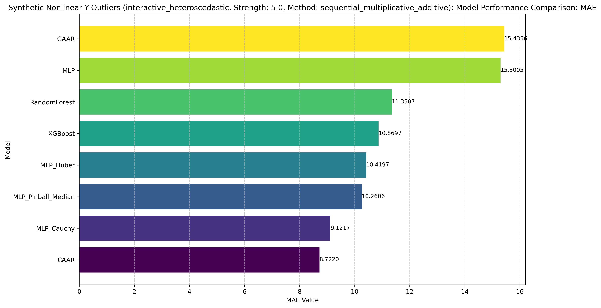

# CAAR 模型鲁棒性：合成数据实验报告

## 1. 引言与背景

本文档详细介绍了在合成数据集上评估柯西推断行动回归（CAAR）模型性能和鲁棒性的实验设置与结果。与真实数据实验相比，合成数据实验允许我们更精确地控制数据生成过程、异常值的类型和强度，从而更细致地分析模型在特定条件下的行为。

这些实验的核心目标是：
1.  验证 CAAR 模型在不同类型数据关系（线性和非线性）下对Y轴异常值的鲁棒性。
2.  与一系列基线模型和鲁棒回归技术进行性能比较。
3.  理解数据特性（如关系复杂性、异常值强度）如何影响各模型的表现。

实验遵循"训练集包含异常点，测试集保持纯净"的原则，以公正评估模型从受污染数据到干净数据的泛化能力。

## 2. 对比方法概述

实验中，CAAR 及 GAAR 方法与多种回归模型进行了对比，这些模型覆盖了常见基线、基于神经网络的对比及鲁棒回归模型，以及与我们提出的新方法。

*   **常见基线模型：**
    *   **OLS (普通最小二乘法):** 作为基础线性模型基准（主要用于线性场景）。
    *   **RandomForest (随机森林回归):** 代表集成学习方法。
    *   **XGBoost (XGBoost 回归):** 高性能梯度提升集成方法。
*   **基于神经网络的对比及鲁棒回归模型：**
    *   **MLP (多层感知机回归 - MSE损失):** 标准神经网络模型，使用均方误差(MSE)损失，作为其他基于MLP方法的基础对比。
    *   **MLP_Huber (多层感知机回归 - Huber损失):** 与MLP结构相似，但使用Huber损失函数（实验中设置delta=1.35），旨在平衡MSE和MAE的特性以抵抗异常值。
    *   **MLP_Pinball_Median (多层感知机回归 - Pinball损失实现中位数回归):** 与MLP结构相似，但使用Pinball损失函数（quantile=0.5）来拟合条件中位数，旨在通过优化中位数目标提升鲁棒性。
    *   **MLP_Cauchy (多层感知机回归 - Cauchy损失):** 采用标准的MLP结构，直接使用柯西分布的负对数似然 (`log(1 + (y - y_hat)^2)`) 作为损失函数。此模型不包含推断/行动框架，主要用于与`CAAR`对比，以评估推断/行动框架在柯西损失之外的额外贡献。
*   **我们的新方法（基于推断/行动框架）：**
    *   **CAAR (柯西推断行动回归):** 通过推断网络为每个样本推断潜在子群体的柯西分布，并利用行动网络进行回归。柯西分布的重尾特性使其对异常值具有天然的鲁棒性。
    *   **GAAR (高斯推断行动回归):** 与CAAR结构相似，但推断网络基于高斯分布假设，用作对比分析分布假设对鲁棒性的影响。

这个模型组合有助于全面评估 CAAR 在不同合成数据场景下的相对优势和劣势，特别是与其他基于相似神经网络架构但采用不同鲁棒策略的模型进行比较。

## 3. 实验设置详解

实验通过 `src/experiments/synthetic_exp.py` 脚本执行。

### 3.1 数据生成

合成数据由 `src/data/synthetic.py` 中的 `prepare_synthetic_experiment` 函数生成。实验主要涵盖以下两种数据生成场景：

1.  **线性关系 (`relation_type='linear'`):**
    *   数据通过 `make_regression` 生成，具有固定的特征数量。
    *   目标 `y` 与特征 `X` 之间存在线性关系。
2.  **非线性关系 (`relation_type='interactive_heteroscedastic'`):**
    *   数据通过自定义函数 `make_interactive_heteroscedastic_regression` 生成。
    *   此场景引入了特征间的交互项以及异方差性（误差方差随X变化），更接近真实世界数据的复杂性。
    *   具体函数形式为：`y = 10 * sin(X[:, 0] * X[:, 1]) + 20 * (X[:, 2] - 0.5)**2 + 10 * X[:, 3] + 5 * X[:, 4] + error`，其中 error 项具有异方差性。

对于每个场景：
*   生成包含 `n_samples_train` (例如 2000), `n_samples_val` (例如 500), 和 `n_samples_test` (例如 500) 的样本。
*   特征数量 `n_features` (例如 10) 和信息特征数量 `n_informative` (例如 5，仅用于线性场景) 被设定。
*   使用固定的 `random_state` 以确保数据生成和划分的可复现性。
*   **关键点：测试集 (`X_test`, `y_test`) 在任何异常值注入之前被分离出来，并保持纯净。**

### 3.2 数据预处理与划分

1.  **标准化:** 特征数据 (`X`) 使用 `sklearn.preprocessing.StandardScaler` 进行标准化。标准化器在完整特征集上拟合，然后在划分前应用于所有数据。
2.  **划分:** 数据按指定比例划分为训练集、验证集和测试集。

### 3.3 异常值注入

异常值**仅注入训练集和验证集**，通过 `src/data/synthetic.py` 中的 `inject_y_outliers` 函数完成。

*   **控制参数:**
    *   `outlier_ratio`: 转化为异常样本的比例 (例如, 0.1, 0.2)。
    *   `outlier_strength`: 一个乘数（实验中通常为 5.0），决定异常值偏离正常值的程度（相对于原始 `y` 值的标准差）。
    *   `y_outlier_method`: 实验中采用 `'sequential_multiplicative_additive'` 方法。该方法结合了乘性和加性噪声来生成异常值，使其更难被简单阈值检测。
        *   一半异常点：`y_outlier = y_normal * (1 + strength) + N(0, global_std_y * 0.1 * strength)`
        *   另一半异常点：`y_outlier = y_normal * (1 - strength) - N(0, global_std_y * 0.1 * strength)`

### 3.4 模型参数与训练

*   **OLS:** 使用 scikit-learn 的默认参数。
*   **RandomForest, XGBoost:** 使用实验脚本中指定的参数 (例如, `n_estimators=100` for RandomForest)。
*   **神经网络模型 (CAAR, GAAR, MLP, MLP_Pinball_Median, MLP_Huber):**
    *   共享参数 (`nn_model_params`):
        *   `input_dim`: 根据数据集动态设置。
        *   `hidden_dims`: `[64, 32]`。
        *   `epochs`: `100`。
        *   `lr`: `0.001`。
        *   `batch_size`: `32`。
        *   `early_stopping_patience`: `10`。
        *   `early_stopping_min_delta`: `0.0001`。
    *   特定参数:
        *   `CAAR` 和 `GAAR`: `latent_dim: 16`。
        *   `MLP_Pinball_Median`: `quantile: 0.5`。
        *   `MLP_Huber`: `delta: 1.35`。
*   模型在（可能受异常值污染的）训练集上训练，验证集用于早停。

### 3.5 重复与评估

*   **重复次数:** 每个实验条件重复 `n_repeats` 次（例如3次），使用不同的随机种子。
*   **评估指标:** 模型在**纯净的测试集**上使用以下指标进行评估：MSE, RMSE, MAE, MdAE, R² 和训练时间。
*   报告结果是这些指标在多次重复中的平均值。

## 4. 实验结果与讨论

本节展示并分析合成数据实验生成的性能表格。

### 4.1 线性关系 - Y轴异常 (Linear Relation - Y-axis Outliers)

下表展示了在线性关系合成数据中注入Y轴异常值（强度5.0，`sequential_multiplicative_additive`方法）后的平均性能：

| Model              |        MSE |      RMSE |      MAE |     MdAE |        R² |   Training Time (s) |
|:-------------------|-----------:|----------:|---------:|---------:|----------:|--------------------:|
| OLS                |  23.6264   |  4.45768  | 3.60779  | 3.11276  |  0.754837 |           0.01243   |
| MLP_Huber          |  14.9165   |  3.66044  | 2.93049  | 9.61678  |  0.845216 |           0.491266  |
| RandomForest       |  69.9558   |  8.35046  | 6.47185  | 5.29195  |  0.274093 |          18.651     |
| XGBoost            |  50.64     |  7.10812  | 5.47561  | 4.53767  |  0.474526 |           0.0929437 |
| CAAR               |   **5.77365**  |  **2.40274**  | **1.92844**  | **1.63222**  |  **0.940089** |           **1.10982**   |
| MLP                | 246.903    | 13.3072   | 10.4783  | 8.734    | -1.56202  |           0.403189  |
| GAAR               |  23.3794   |  4.55546  | 3.60345  | 2.98298  |  0.7574   |           0.973559  |
| MLP_Pinball_Median |   8.1679   |  2.83362  | 2.26673  | 1.97885  |  0.915244 |           0.446467  |
| MLP_Cauchy         |   6.46348  |  2.5412   | 2.01949  | 1.71246  |  0.932931 |           0.607094  |

*数据来源: `results/synthetic_linear_y_outliers/performance_table.md`*

**结果分析 (线性关系 - Y轴异常):**
*   **CAAR 表现最佳：** 在新的线性关系且存在Y轴异常的场景下，**CAAR (MSE **5.77**, RMSE **2.40**, MAE **1.93**, MdAE **1.63**, R² **0.9401**)** 在所有关键评估指标上均取得了最佳性能，显著优于其他模型。
*   **MLP_Cauchy 表现优异，紧随其后：** **MLP_Cauchy (MSE 6.46, RMSE 2.54, MAE 2.02, MdAE 1.71, R² 0.9329)** 的性能也非常出色，是表现第二好的模型，其各项指标都非常接近 CAAR。
*   **MLP_Pinball_Median表现良好：** **MLP_Pinball_Median (MSE 8.17, RMSE 2.83, MAE 2.27, MdAE 1.98, R² 0.9152)** 的性能位列第三，同样展示了较好的鲁棒性。
*   **MLP_Huber的MSE/RMSE/MAE/R²尚可但MdAE依然偏高：** **MLP_Huber (MSE 14.92, RMSE 3.66, MAE 2.93, R² 0.8452)** 的MSE, RMSE, MAE 和 R² 表现尚可，但其MdAE (9.62) 指标依然异常偏高，这与之前的观察一致，可能指示Huber损失虽然能处理一些异常值，但在中位数绝对误差上表现不佳。
*   **OLS和GAAR受到显著影响：** OLS (R² 0.7548) 和 GAAR (R² 0.7574) 受到异常值较大影响，但R²仍为正，显示出一定的预测能力，GAAR在此场景下表现略好于OLS。
*   **RandomForest, XGBoost表现一般。**
*   **标准MLP失效：** 标准MLP (R² -1.5620) 在此场景下完全失效。
*   **训练时间：** CAAR (**1.11s**) 的训练时间比 MLP_Cauchy (0.61s), MLP_Pinball_Median (0.45s) 和 MLP_Huber (0.49s) 略长，但仍在合理范围内。

**相关图表 (线性关系 - Y轴异常):**
*   MSE 性能对比: 
*   RMSE 性能对比: 
*   MAE 性能对比: 
*   MdAE 性能对比: 
*   R² 性能对比: 
*   MSE 趋势图: 
*   RMSE 趋势图: 
*   MAE 趋势图: 
*   MdAE 趋势图: 
*   R² 趋势图: 

### 4.2 非线性关系 ('interactive_heteroscedastic') - Y轴异常

下表展示了在非线性（含交互项和异方差性）合成数据中注入Y轴异常值（强度5.0，`sequential_multiplicative_additive`方法）后的平均性能：

| Model              |     MSE |    RMSE |      MAE |    MdAE |        R² |   Training Time (s) |
|:-------------------|--------:|--------:|---------:|---------:|----------:|--------------------:|
| RandomForest       | 214.826 | 14.6441 | 11.3507  |  9.40755 |  0.199671 |          21.4498    |
| MLP_Huber          | 156.286 | 12.2985 |  9.70652 | 15.5653  |  0.417761 |           0.989656  |
| XGBoost            | 195.47  | 13.9684 | 10.8697  |  9.08539 |  0.27178  |           0.0913019 |
| CAAR               | **112.354** | **10.5995** |  **8.31522** |  **6.72213** |  **0.581427** |           **0.89272**   |
| MLP                | 655.528 | 23.3992 | 18.5203  | 15.3944  | -1.44215  |           0.969012  |
| GAAR               | 431.653 | 19.3044 | 15.3895  | 12.9653  | -0.608111 |           1.51398   |
| MLP_Pinball_Median | 133.858 | 11.5008 |  9.15828 |  7.69154 |  0.501313 |           0.920086  |
| MLP_Cauchy         | 118.616 | 10.8898 |  8.53095 |  7.10751 |  0.5581   |           1.87146   |

*数据来源: `results/synthetic_nonlinear_y_outliers/performance_table.md`*

**结果分析 (非线性关系 - Y轴异常):**
*   **CAAR 在非线性场景下表现最佳：** 在更复杂的非线性（含交互项和异方差性）数据且存在Y轴异常的场景下，**CAAR (MSE **112.35**, RMSE **10.60**, MAE **8.32**, MdAE **6.72**, R² **0.5814**)** 在所有五个关键评估指标上均取得了最佳成绩，全面超越了包括MLP_Cauchy在内的其他模型。
*   **MLP_Cauchy 表现次之：** **MLP_Cauchy (MSE 118.62, RMSE 10.89, MAE 8.53, MdAE 7.11, R² 0.5581)** 的性能表现第二，其各项指标都略逊于 CAAR。
*   **MLP_Pinball_Median表现第三：** **MLP_Pinball_Median (MSE 133.86, RMSE 11.50, MAE 9.16, MdAE 7.69, R² 0.5013)** 表现尚可，但与CAAR和MLP_Cauchy有一定差距。
*   **CAAR 与 MLP_Cauchy 的对比启示：** 在这种复杂的非线性场景下，与之前的实验结果不同，`CAAR` 的表现优于 `MLP_Cauchy`。这可能暗示，对于当前采用的推断/行动框架结构和训练方式，在数据关系更复杂、可能更接近真实世界挑战时，其优势开始显现。推断/行动框架可能在这种情况下更好地捕捉了数据变化的复杂性或异常的结构。`CAAR` 的训练时间 (**0.89s**) 在这个场景下比 `MLP_Cauchy` (1.87s) 更短。
*   **MLP_Huber表现尚可：** MLP_Huber (R² 0.4178) 在此场景下表现优于XGBoost和RandomForest，但不如上述三个基于特定鲁棒损失或框架的模型。其MdAE (15.57) 仍然显著偏高。
*   **XGBoost和RandomForest表现不佳。**
*   **MLP和GAAR失效。**

**相关图表 (非线性关系 - Y轴异常):**
*   MSE 性能对比: 
*   RMSE 性能对比: 
*   MAE 性能对比: 
*   MdAE 性能对比: 
*   R² 性能对比: 
*   MSE 趋势图: 
*   RMSE 趋势图: 
*   MAE 趋势图: 
*   MdAE 趋势图: 
*   R² 趋势图: 

## 5. 初步结论与展望

基于对两种合成数据集（线性关系、非线性交互异方差关系）在Y轴异常（强度5.0，`sequential_multiplicative_additive`方法）场景下的**新一轮**实验结果，我们可以得出以下初步结论：

*   **CAAR 在不同数据场景下均展现出最强大的鲁棒性：**
    *   在线性关系下，**CAAR (R² **0.9401**)** 的性能最佳，优于 **MLP_Cauchy (R² 0.9329)** 和 **MLP_Pinball_Median (R² 0.9152)**。
    *   在更具挑战性的非线性（含交互项和异方差性）数据中，**CAAR (R² **0.5814**)** 的表现同样最佳，优于 **MLP_Cauchy (R² 0.5581)** 和 **MLP_Pinball_Median (R² 0.5013)**。

*   **推断/行动框架的价值分析（基于新结果）：**
    *   与上一轮结果相比，本轮实验中 `CAAR` 在线性和非线性场景下均一致地超越了 `MLP_Cauchy`。这更强有力地证明了推断/行动框架的价值，尤其是在处理具有复杂非线性关系和异方差性的数据时。单纯依赖鲁棒损失函数（如 `MLP_Cauchy`）可能不足以达到 `CAAR` 通过推断潜在子群体分布并进行相应调整所能达到的性能水平。
    *   这表明 `CAAR` 模型中的推断/行动框架设计，在新调整的数据生成过程（特别是 `interactive_heteroscedastic` 的新实现）下，更能有效地发挥其潜力。

*   **MLP_Cauchy 和 MLP_Pinball_Median作为稳健的鲁棒方法：**
    *   `MLP_Cauchy` 在两种场景下都是表现第二好的模型，证明了柯西损失的有效性。
    *   `MLP_Pinball_Median` 表现位列第三，是一种可靠的鲁棒替代方案，但通常不如基于柯西损失或CAAR框架的方法。

*   **MLP_Huber的表现具有场景依赖性，且MdAE指标问题依旧存在。**

*   **模型对数据复杂性和异常值的敏感度：**
    *   **OLS** 仅在线性数据上（如果异常不是极端严重）尚能提供一些基准，但在非线性或强异常场景下完全失效。
    *   **标准MLP和GAAR** 在两种合成数据场景下，当Y轴异常存在时，表现均不佳，R²多为负值，显示它们难以应对异常值和复杂数据结构的双重挑战。
    *   **RandomForest和XGBoost** 等集成方法，在非线性数据上表现出一定的建模能力，但其鲁棒性普遍不如专门设计的鲁棒模型，尤其是在非线性场景中与CAAR等模型差距明显。

*   **未来工作展望（部分基于新结果调整）：**
    *   **深入分析推断/行动框架的贡献：** 既然新结果显示 `CAAR` 的优越性，可以进一步深入分析其推断网络（`l_i`, `s_i` 的学习）和行动网络是如何协同工作的，尤其是在复杂的非线性异方差场景下。研究推断出的柯西分布参数 (`mu_y`, `gamma_y`) 与真实数据特性及异常值的对应关系。
    *   **优化CAAR的推断/行动机制：** 尽管表现良好，但仍可探索改进 `CAAR` 推断网络结构、行动网络与推断结果的交互方式，或损失函数中对 `gamma_y` 的利用，以期在更广泛的复杂场景下持续提升性能。
    *   **数据生成机制的影响：** 鉴于 `interactive_heteroscedastic` 数据生成方式的调整显著影响了模型间的相对性能（特别是CAAR与MLP_Cauchy），未来可以设计更多样化和受控的非线性/异方差数据生成过程，以全面评估模型的适应性。
    *   **不同强度和比例的异常值：** 继续系统研究不同`outlier_strength`和`outlier_ratio`对各模型性能的影响。
    *   **X轴异常值实验：** 执行并分析X轴异常（杠杆点）对模型性能的影响。
    *   **超参数敏感性分析：** 针对表现较好的模型（如CAAR, MLP_Cauchy, MLP_Pinball_Median），研究其关键超参数对鲁棒性的影响。

总而言之，**新一轮的合成数据实验结果更加一致地突显了 CAAR 模型在处理线性和复杂非线性数据中Y轴异常的卓越鲁棒性。** 推断/行动框架在调整后的数据生成机制下，显示出其在复杂场景中超越单纯鲁棒损失函数的潜力。MLP_Cauchy 和 MLP_Pinball_Median 依然是强有力的鲁棒备选方案。

---
*本报告基于对提供的Python脚本和性能表格数据的分析。通过可视化生成的图表和检查 `full_results.pkl` 中的原始结果，可能会获得更深入的见解。* 